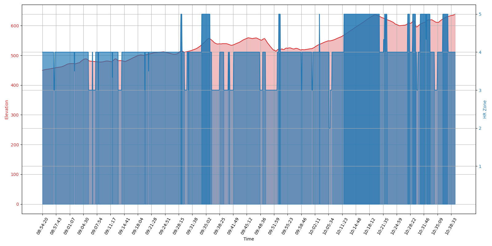

# Maps scripts

Scripts and utilities to work with maps, `gpx` files etc.  

## Files

*	`out/` : output
*	`src/` : source code, scripts
*	`samples/` : sample data
	*	`samples/gpx/` : 
	*	`samples/gpx/private/` : you can put private samples there (ignored by git)
	*	`samples/gpx/mtb-ride.gpx` : a sample mtb ride, containing positions, time, elevation, heart rate
	*	`samples/out/` : output examples
		*	`samples/out/mtb-ride_hr-zones.png` : refers to `mtb-ride.gpx`
		*	`samples/out/mtb-ride-extended_hr-zones.png` : refers to an extended version of `mtb-ride.gpx`

### Scripts

*	`hr_zones.py` : expor heart rate from `gpx`, calculate heart rate zones and either plot them or export them in `csv`
*	`extract_hr.py` : export heart rate data from a `gpx` file, using the garmin v1 schema, to `csv`, `txt`
